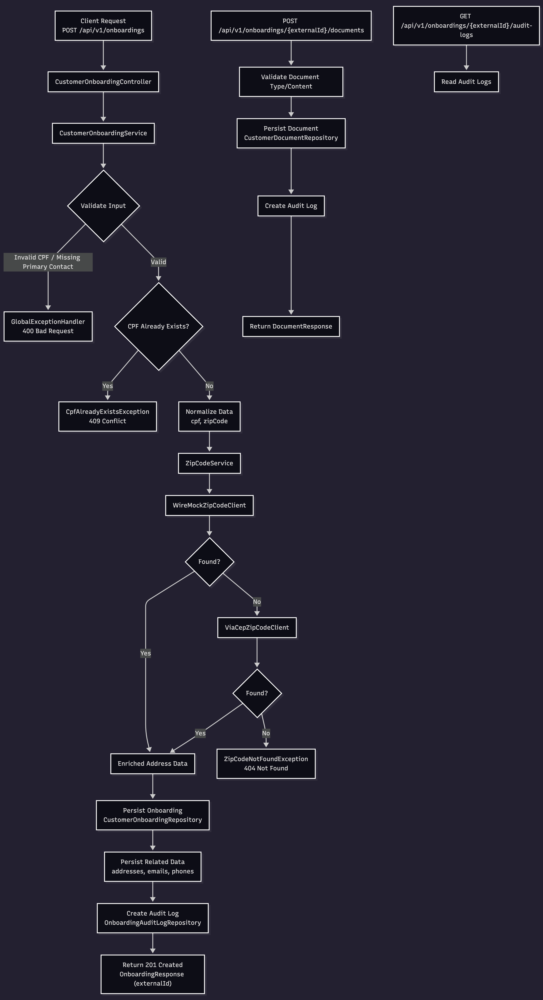

# Customer Onboarding API

A production-like backend API for bank customer onboarding.

This service manages customer onboarding creation, address enrichment through zip code providers, document upload, and audit logging with a clean layered architecture.

## Table of Contents
- [Overview](#overview)
- [System Demo](#system-demo)
- [Diagrams](#diagrams)
- [Business Rules](#business-rules)
- [Architecture](#architecture)
- [Tech Stack](#tech-stack)
- [Project Structure](#project-structure)
- [Requirements](#requirements)
- [Running the Project](#running-the-project)
- [Docker Environments](#docker-environments)
- [Environment Variables](#environment-variables)
- [Database and Migrations](#database-and-migrations)
- [API Reference](#api-reference)
- [Error Response Contract](#error-response-contract)
- [Testing](#testing)
- [Observability](#observability)
- [Development Notes](#development-notes)

## Overview
The API provides onboarding operations for a banking scenario:
- Create onboarding records with CPF validation and normalization.
- Enrich addresses from zip code providers before persistence.
- Upload and list documents linked to onboarding records.
- Expose onboarding history through audit logs.
- Return standardized error responses.

## System Demo
<!-- TODO: Replace with your system demo GIF/video/screenshot -->
<!-- Example:  -->

_Add your demo media here._

## Diagrams
Current onboarding flow diagram:



## Business Rules
- Every `CustomerOnboarding` must have a valid CPF.
- CPF must be unique.
- At creation time, at least one primary contact method is required (email or phone).
- At most one primary email, phone, and address per onboarding.
- Address data is enriched via zip code providers before saving.
- Public API uses `externalId` (`UUID`) and never exposes internal DB IDs.

## Architecture
Layered architecture:

`Controller -> Service -> Repository / Client`

Responsibilities:
- Controllers: HTTP layer only, thin endpoints.
- Services: business rules and orchestration.
- Repositories: persistence access only.
- Clients: external integrations (`WireMock`, `ViaCEP`).

Zip code fallback strategy:
1. `WireMockZipCodeClient`
2. `ViaCepZipCodeClient` (fallback if not found)

## Tech Stack
- Java 21
- Spring Boot 4
- Maven
- Spring Web, Validation, Data JPA, Actuator
- PostgreSQL
- Flyway
- Springdoc OpenAPI (Swagger UI)

## Project Structure
```text
src/main/java/io/github/kbdemiranda/customer/onboarding
  |- controller
  |- service
  |- repository
  |- client
  |- entity
  |- dto
  |- mapper
  |- exception
  |- config

src/main/resources
  |- application.yml
  |- db/migration

wiremock/mappings
```

## Requirements
- Java 21
- Docker + Docker Compose v2
- Optional for local non-container run: Maven Wrapper (`./mvnw`)

## Running the Project
### Option 1: Full Docker (recommended)
Use one of the environment-specific compose files below.

Before running, create your local env file:
```bash
cp .env.model .env
```

### Option 2: Run API locally + infra in Docker
1. Start dependencies:
```bash
docker compose -f docker-compose.local.yml up -d postgres wiremock
```
2. Run API:
```bash
./mvnw spring-boot:run
```

Default API URL: `http://localhost:8080`

## Docker Environments
Three compose files are available:

- `docker-compose.local.yml`: local development (builds API image from source).
- `docker-compose.dev.yml`: development environment (uses prebuilt image from `APP_IMAGE`).
- `docker-compose.prod.yml`: production-like runtime (uses prebuilt image from `APP_IMAGE`).
- `docker-compose.hub.yml`: runs API and frontend from Docker Hub images.

### Local
Start:
```bash
docker compose -f docker-compose.local.yml up -d --build
```
Stop:
```bash
docker compose -f docker-compose.local.yml down
```

### Dev
Start:
```bash
docker compose -f docker-compose.dev.yml up -d
```
Stop:
```bash
docker compose -f docker-compose.dev.yml down
```

### Prod
Start:
```bash
docker compose -f docker-compose.prod.yml up -d
```
Stop:
```bash
docker compose -f docker-compose.prod.yml down
```

### Docker Hub (API + Frontend)
Uses:
- `kbdemiranda/java-customer-onboarding-api`
- `kbdemiranda/react-customer-onboarding-web`

Start:
```bash
docker compose -f docker-compose.hub.yml up -d
```
Stop:
```bash
docker compose -f docker-compose.hub.yml down
```

Default URLs:
- Frontend: `http://localhost:3000`
- API: `http://localhost:8080`

## Environment Variables
Main application variables:
- `SERVER_PORT` (default `8080`)
- `SPRING_PROFILES_ACTIVE` (`local`, `dev`, `prod`)
- `SPRING_DATASOURCE_URL`
- `SPRING_DATASOURCE_USERNAME`
- `SPRING_DATASOURCE_PASSWORD`
- `ZIP_CODE_WIREMOCK_BASE_URL`
- `ZIP_CODE_VIACEP_BASE_URL`

Database/container variables:
- `POSTGRES_DB`
- `POSTGRES_USER`
- `POSTGRES_PASSWORD`
- `POSTGRES_PORT` (local/dev)
- `WIREMOCK_PORT` (local/dev)
- `APP_IMAGE` (dev/prod)
- `APP_IMAGE_HUB` (Docker Hub compose)
- `FRONTEND_IMAGE_HUB` (Docker Hub compose)
- `FRONTEND_PORT` (Docker Hub compose)

Reference files:
- `.env.model` (versioned template)
- `.env` (local, not versioned)

## Database and Migrations
- Database: PostgreSQL
- Migration tool: Flyway
- Schema generation is not automatic (`ddl-auto=validate`).
- All schema changes must be done via new migration files in:
  - `src/main/resources/db/migration`

## API Reference
Base path: `/api/v1`

Onboarding:
- `POST /api/v1/onboardings`
- `GET /api/v1/onboardings`
- `GET /api/v1/onboardings/{externalId}`

Documents:
- `POST /api/v1/onboardings/{externalId}/documents`
- `GET /api/v1/onboardings/{externalId}/documents`

Audit:
- `GET /api/v1/onboardings/{externalId}/audit-logs`

Zip code support endpoints:
- `GET /api/v1/zip-codes/{zipCode}`
- `GET /api/v1/zip-code-query-logs`

Swagger/OpenAPI:
- Swagger UI: `http://localhost:8080/swagger-ui.html`
- OpenAPI JSON: `http://localhost:8080/v3/api-docs`

## Error Response Contract
Errors follow this format:

```json
{
  "timestamp": "...",
  "status": 400,
  "error": "Bad Request",
  "message": "...",
  "path": "..."
}
```

Implemented with global exception handling (`@RestControllerAdvice`).

## Testing
Run all tests:
```bash
./mvnw clean test
```

Current test coverage includes:
- Service unit tests
- Controller tests
- Client behavior tests

## Observability
Spring Boot Actuator is enabled.

Exposed endpoints:
- `/actuator/health`
- `/actuator/info`

## Development Notes
- Use constructor injection.
- Prefer records for DTOs when applicable.
- Keep backend naming in English (`zipCode`, not `cep` internally).
- Keep `cep` only where external provider payloads require it.
- Do not expose internal database IDs in API contracts.
- Build features in small, safe increments.
